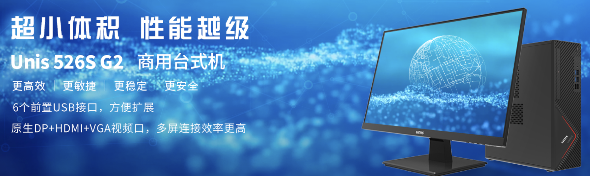
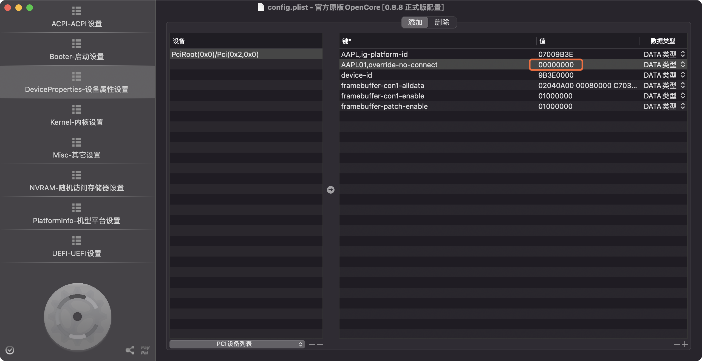

## Unis-526S-G2 Hackintosh OpenCore EFI

### [简体中文](README.zh_CN.md)

### OpenCore

[OpenCore 0.8.9](https://github.com/acidanthera/OpenCorePkg)

### OS Version Tested

- macOS Monterey 12.x
- macOS Ventura  13.x 

### Hardware

- Motherboard: Unis B560
- Bios Version:3004_A05 X64
- CPU: Intel i5-10400
- RAM: KINGBANK 8GB DDR4 2666 + SEIWHALE 8GB DDR4 2666
- SSD: HIKVISION C2000 Pro 512G nvme m.2
- iGPU: Intel UHD Graphic 630
- Audio: Realtek ALC897
- Ethernet Card: Realtek 8168
- PSU: 180W 

### Notes
 - Use [OpenCore Configurator](https://mackie100projects.altervista.org/opencore-configurator/) build your SMBIOS
 - U Must disabled CFG LOCK in bios
 - U Must change DVMT 32MB to 64MB in bios
 - When u only use 10th CPU UHD630 on Unis-526S-G2 with HDMI
 - 1.search montior EDID in Windows
 - 2.U must insert your montior EDID in config.plist DeveciProperties -- PciRoot(0x0)/Pci(0x2,0x0) -- AAPL01,override-no-connect -- 00000000 00000000 00000000 （replace this）  
 
[500Series With 10th CPU UHD630 in Macos Video](https://www.bilibili.com/video/BV1UW4y1J7J2/)

### Bios Setup

| Name | Option |
| ----- | --- |

### Known issues

- No Wireless LAN Adapter，So `WiFi` and `Bluetooth` unserviceable
- No `HDMI Audio` 

### PC CASE
