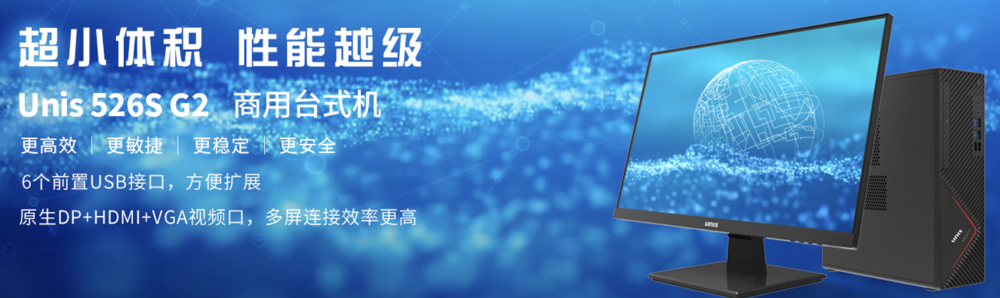
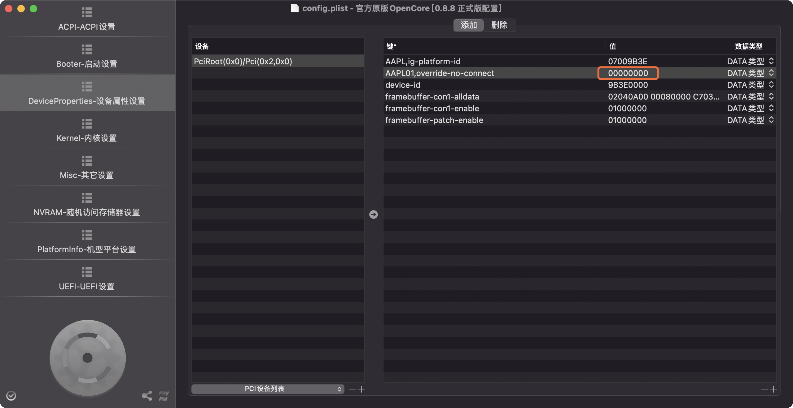
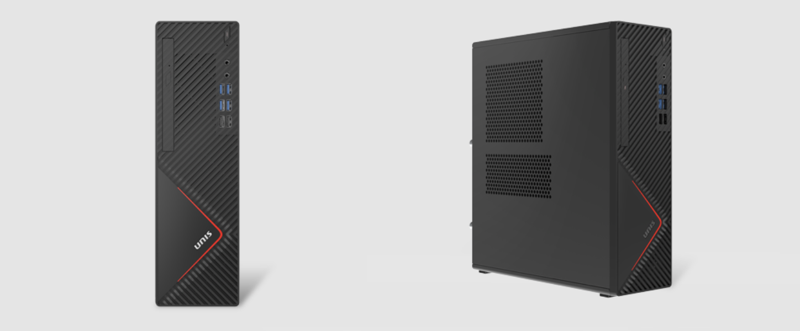

## 紫光Unis-526S-G2 10代核显黑苹果 OpenCore EFI

### [English](https://github.com/hackintosh-efi/Unis-526S-G2-OpenCore)

### OpenCore

[OpenCore 0.9.7](https://github.com/acidanthera/OpenCorePkg)

### 可安装系统

- macOS Monterey 12.x
- macOS Ventura  13.x 

### 硬件
- 主板:紫光B560
- Bios版本: 3004_A05 X64
- 处理器: 英特尔 i5-10400
- 内存: 金百达 16GB DDR4 2666 + 枭鲸 16GB DDR4 2666
- 硬盘: 海康威视 C2000 Pro 512GB nvme m.2
- 核显: 英特超核心显卡 630
- 声卡: 瑞昱 ALC897
- 网卡: 瑞昱 8168
- 电源: 180W

### 注意事项
 - 使用 [OpenCore Configurator](https://mackie100projects.altervista.org/opencore-configurator/) 生成 SMBIOS
 - 使用前务必在BIOS解锁CFG LOCK
 - 使用前务必在BIOS修改DVMT 32兆 ==> 64兆
 - 当你在500系主板使用10代CPU的 UHD630显卡时你还需要下述步骤
 - 1.在windows下提取显示器EDID
 - 2.在配置文件config.plist DeveciProperties -- PciRoot(0x0)/Pci(0x2,0x0) -- AAPL01,override-no-connect -- 00000000（这里填入你提取的EDID）

[500Series With 10th CPU UHD630 in Macos Video](https://www.bilibili.com/video/BV1UW4y1J7J2/)

### 已知问题

- 未安装无线网卡，故`WiFi` 和 `蓝牙` 无法使用
- `HDMI音频` 无法使用

### 机箱展示

### 联系我们 

- QQ群: 23304408

